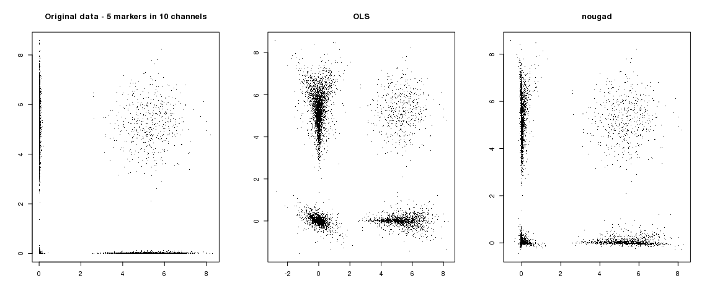
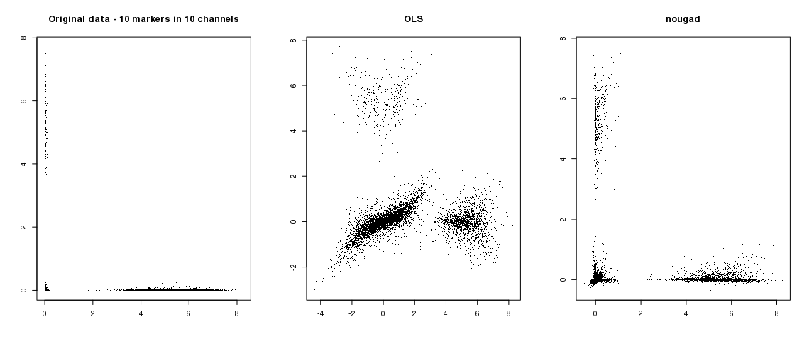
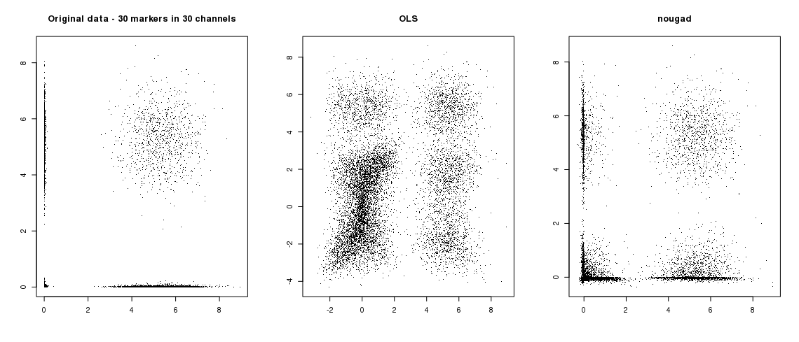
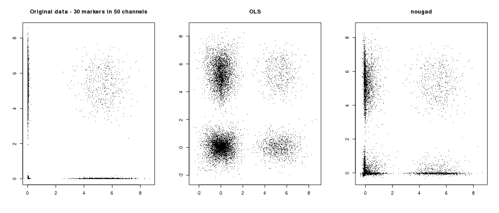

# nougad -- Non-linear unmixing by gradient descent

**DANGER:** this is in development right now.

This is as a part of PanelBuildeR (https://github.com/exaexa/panelbuilder),
implementing fast variants of the gradient-descent based unmixing. With a bit
of luck, you may be able to use the package standalone as well -- the package
exports a single function `nougad` which has standard documentation.

Importantly, this package has multiple versions with other fast
implementations. The default version with "canonical" C implementation of the
unmixing is in branch `master`; you may install it with devtools as follows:

```r
devtools::install_github("exaexa/nougad")
```

After that, either use the function from PanelBuilder, or read the
documentation using `?nougad`.

## Accelerated variants

### Vulkan

You may try a Vulkan variant of the function, which should be able to use your
Vulkan-compatible GPU. You need to have Vulkan C library and headers installed
(usually from package like `libvulkan-dev`). You also need the ICD runtime for
your hardware (usually in packages such as `mesa-vulkan-drivers` or
`nvidia-vulkan-icd`).

Install with:
```r
devtools::install_github('exaexa/nougad', ref='vulkan')
```

You may need to set the Vulkan device that nougad should use (devices are
indexed from 0):
```r
options(nougad.vulkan.device = 1)
```

### CUDA

TBD

## Why non-linear weighted unmixing?

In short, it can help you filter lots of unwanted noise from highly-expressed
channels, which reduces the (induced) noise around zero. The following examples
show the problem on a common use-case from cytometry. The data is generated
using the `nougad.benchmark` function, refer to the source. Notably, the
original cell expressions have a very precise zeroes (compare that with the
very precise measurements from mass cytometry). Ideally, this is only disturbed
by positive Poisson noise, and data are never negative. OLS, on the other hand,
cannot handle these distinctions, and produces problems, mostly the infamous
"spillover spread".

#### Example: 5 markers in 10 channels



#### Example: 10 markers in 10 channels



#### Example: 30 markers in 30 channels



#### Example: 30 markers in 50 channels


